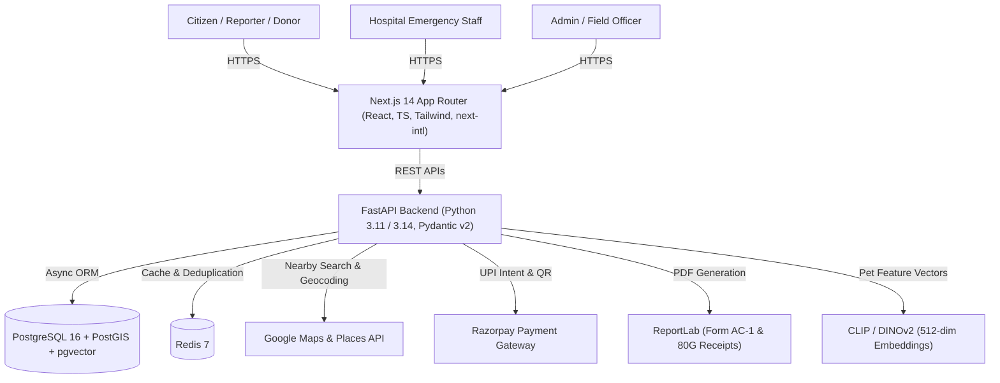

# Animal Guardian 360° 🐾🇮🇳

> **Production-Ready Web Platform for Animal Welfare & Emergency Rescue in India**

Animal Guardian 360° is a high-performance, mobile-first web platform architected to solve critical animal welfare challenges across India: rapid road accident SOS dispatches, community cruelty reporting with abuse prevention, AI-powered lost and found pet recovery, and transparent Section 80G tax-exempt UPI donations.

---

## 🏗️ Architecture & Tech Stack



### Stack Components
- **Frontend**: Next.js 14 (App Router) + TypeScript + Tailwind CSS + Lucide Icons + `next-intl` (English & Hindi)
- **Backend**: FastAPI, Pydantic v2, SQLAlchemy 2 (asyncio) + Alembic
- **Databases**:
  - **PostgreSQL 16** with **PostGIS** for spatial geospatial queries (GIST index on geography points)
  - **pgvector** for high-dimensional image embeddings (HNSW cosine similarity index)
- **Cache & Fast State**: Redis 7 (10-minute Places caching, rate-limiting, and deduplication)
- **AI / Embeddings**: 512-dimensional L2-normalized image embeddings with cosine similarity matching within a 25 km radius
- **Payments**: Razorpay (UPI Intent + QR code checkout), HMAC-SHA256 signature verification, idempotent webhooks, Section 80G PDF receipts
- **Document Generation**: ReportLab for Police Form AC-1 Complaint PDFs and Section 80G Income Tax Receipts
- **Security & Privacy**: HMAC-SHA256 hashed OTPs, JWT access/refresh tokens, EXIF GPS stripping from public uploads, 3-strike abuse escalation, DPDP Act alignment

---

## 🌟 Core Features

### 1. Vet Hospitals Near You & Road Accident SOS
- **GPS Location**: Detects browser geolocation with manual fallback search.
- **Nearby Vets**: Queries Google Places API (`veterinary_care`), calculates Haversine/PostGIS distance, caches in Redis for 10 minutes.
- **Road Accident SOS Flow**:
  - One-tap SOS triggers multi-hospital dispatch to the 3 nearest registered veterinary clinics.
  - Generates secure one-time tokens (`/dispatch/{token}/action`) for Accept / Decline.
  - **Atomic Case Lock**: First hospital acceptance locks the case, preventing duplicate responses.
  - **Automatic 5-Minute Escalation**: Background task re-dispatches to the next nearest clinics if unaccepted within 5 minutes.
  - Real-time hospital dashboard tracks case stages: `alerted` $\rightarrow$ `accepted` $\rightarrow$ `reached` $\rightarrow$ `closed`.

### 2. Report Animal Cruelty & 3-Strike Anti-Abuse
- **One-Tap Reporting**: Submit incident category (`cruelty`, `illegal_trade`, `abandonment`, `other`), GPS location, and media.
- **Identity Privacy**: Optional anonymous reporting mode conceals citizen identity.
- **Sanitized Media**: Strips sensitive EXIF GPS metadata from public views.
- **Police Station Locator & Form AC-1 PDF**: Locates nearest police station via Google Places (`police`), provides a "Call 112" shortcut, and compiles a formal Indian Police Complaint Summary (Form AC-1) PDF. *(Includes citizen disclaimer that FIR must be lodged in person).*
- **Anti-Abuse System**:
  - Rate limiting (maximum 5 reports/day per account).
  - Spatial-temporal deduplication (flags duplicates within 100 meters and 2 hours).
  - 3-strike escalation: Admin review marks fake reports $\rightarrow$ Strikes 1 & 2 trigger warnings $\rightarrow$ Strike 3 locks reporting for 30 days.

### 3. AI-Powered Lost & Found Pet Recovery
- **Post Types**: "Lost", "Found", or "Community Sighting".
- **pgvector & CLIP Search**: 512-dimensional vector embeddings stored in pgvector. Cosine similarity search filters against opposite-type posts within a configurable **25 km radius** and temporal window.
- **Empirical Precision/Recall Evaluation**: Includes `backend/scripts/evaluate_pet_matches.py` benchmark to validate model accuracy across thresholds (0.50–0.90; optimal threshold: 0.85).
- **Masked Contact & Privacy**: In-app masked relay shields pet owner phone numbers from public harvesting.
- **Community Sighting Map & Filters**: Filter by species, breed, primary/secondary color, and status (`active` / `reunited`).

### 4. Donate via UPI & Public Transparency Ledger
- **Razorpay UPI & QR Checkout**: Direct UPI Intent and dynamic QR codes.
- **HMAC-SHA256 Signature Verification**: Cryptographically verifies all payment signatures.
- **Idempotent Webhooks**: Re-delivered webhook notifications cannot double-credit campaigns or cause duplicate receipts.
- **Section 80G Tax Exemption Receipts**: Generates instant PDF tax receipts compliant with CBDT rules under Section 80G(5)(vi) of the Income Tax Act, 1961, with donor PAN, receipt number, and statutory declarations.
- **Public Financial Transparency Ledger**: Real-time ledger showing funds raised, allocations across categories (*Rescue Ops*, *Shelters*, *Medical Supplies*, *Food & Feeding*, *Infrastructure*), and audited expense entries with invoice URLs.

### 5. High-Privilege Admin Console
- **Operational KPIs**: Live counts of users, accident dispatches, cruelty reports in queue, reunited pets, and audited funds.
- **Cruelty Moderation Queue**: Approve reports or mark fake (issuing strikes).
- **Hospital Verification**: Verify clinic registrations after physical/license checks.
- **Strike Management**: Inspect community strikes and revoke strikes on appeal.
- **Audited Expense Posting**: Record expenditures with category and receipt URLs.
- **Audit Trail**: Immutable chronological log of all administrator actions.

---

## 🚀 Quick Start & Local Setup

### Prerequisites
- Docker & Docker Compose
- Python 3.11+ (Python 3.14 supported)
- Node.js 18+ and npm

### 1. Environment Configuration
Copy the sample environment file:
```bash
cp .env.example .env
```
Fill in your API keys (defaults run in simulation/test mode):
- `GOOGLE_MAPS_API_KEY`: Google Places & Maps JavaScript API key
- `RAZORPAY_KEY_ID` & `RAZORPAY_KEY_SECRET`: Razorpay test keys
- `SECRET_KEY`: JWT HMAC key (e.g., `openssl rand -hex 32`)

---

### 2. Run with Docker Compose (Recommended)
Launch the complete stack (PostgreSQL with PostGIS + pgvector, Redis, FastAPI, Next.js):
```bash
docker compose up --build
```
- **Web App**: http://localhost:3000
- **API Documentation (Swagger)**: http://localhost:8000/docs
- **API ReDoc**: http://localhost:8000/redoc

---

### 3. Run Manually (Local Dev)

#### Backend Setup
```bash
cd backend
python -m venv venv

# Windows PowerShell:
.\venv\Scripts\Activate.ps1
# macOS/Linux:
source venv/bin/activate

pip install -r requirements.txt

# Run migrations
alembic upgrade head

# Start FastAPI server
uvicorn app.main:app --host 0.0.0.0 --port 8000 --reload
```

#### Frontend Setup
```bash
cd frontend
npm install
npm run dev
```

---

## 🧪 Testing & Verification

### Backend Tests (55/55 Passing)
The test suite uses isolated in-memory SQLite and async fixtures:
```bash
# Windows PowerShell
$env:PYTHONPATH="backend"
backend\venv\Scripts\pytest.exe -p no:cov -v backend/tests/

# macOS / Linux
PYTHONPATH=backend pytest -p no:cov -v backend/tests/
```

| Test Suite | Description | Status |
| :--- | :--- | :---: |
| `test_auth.py` | OTP hashing, normalization, JWT lifecycle, roles | **16 / 16 PASSED** |
| `test_vets.py` | Google Places, Redis cache, 3-hospital SOS dispatch, atomic locking | **9 / 9 PASSED** |
| `test_reports.py` | Form AC-1 PDF, EXIF stripping, 100m deduplication, 3-strike lock | **7 / 7 PASSED** |
| `test_pets_vector.py` | 512-dim vector normalization, cosine math, 25 km filter, sightings | **8 / 8 PASSED** |
| `test_donations.py` | Razorpay orders, HMAC signatures, 80G receipt PDF, idempotency | **10 / 10 PASSED** |
| `test_admin.py` | KPI aggregation, hospital verification, strike revocation, audit log | **5 / 5 PASSED** |
| **Total** | **Unified Test Suite** | **55 / 55 PASSED** |

### Offline AI Precision/Recall Evaluation
Run the pet similarity benchmark:
```bash
python backend/scripts/evaluate_pet_matches.py
```
Outputs precision, recall, and F1-score across similarity thresholds (0.50 to 0.90) on a labeled ground-truth pet pairing dataset.

### End-to-End Tests (Playwright)
```bash
cd frontend
npx playwright test
```

---

## 📜 API Documentation Summary

| Method | Endpoint | Description |
| :--- | :--- | :--- |
| `POST` | `/api/v1/auth/otp/send` | Send 6-digit OTP to phone or email |
| `POST` | `/api/v1/auth/otp/verify` | Verify OTP and return JWT access/refresh token pair |
| `GET` | `/api/v1/vets/nearby` | Find nearest verified clinics within radius (Redis cached) |
| `POST` | `/api/v1/accidents/sos` | Dispatch road accident SOS to 3 nearest hospitals |
| `POST` | `/api/v1/accidents/dispatch/{token}/action` | Hospital one-time action: Accept / Decline |
| `POST` | `/api/v1/reports` | Submit animal cruelty report with media and GPS |
| `GET` | `/api/v1/reports/{id}/pdf` | Download police Form AC-1 Complaint PDF |
| `POST` | `/api/v1/pets/posts` | Create Lost/Found pet post and generate pgvector embedding |
| `GET` | `/api/v1/pets/posts` | Search community sightings with filters (species, breed, radius) |
| `POST` | `/api/v1/donations/orders` | Create Razorpay order for UPI checkout |
| `POST` | `/api/v1/donations/verify` | Verify HMAC payment signature and issue Section 80G receipt |
| `GET` | `/api/v1/donations/{id}/receipt` | Download official Section 80G tax receipt PDF |
| `GET` | `/api/v1/donations/transparency` | Public transparency ledger and category allocation |
| `GET` | `/api/v1/admin/stats` | Unified operational KPIs across all platform subsystems |
| `PATCH` | `/api/v1/admin/hospitals/{id}/verify` | Verify or reject veterinary hospital registration |
| `DELETE` | `/api/v1/admin/strikes/{id}` | Revoke anti-abuse strike and lift user suspension |

---

## 🔒 Statutory Compliance & Governance
- **Section 80G & 12A**: All donations processed through the platform are eligible for 50% tax deductions under Section 80G(5)(vi) of the Indian Income Tax Act, 1961.
- **DPDP Act (Digital Personal Data Protection Act, 2023)**: User contact details are masked during pet sighting chats and cruelty reporting; location coordinates are stripped of precise EXIF data on public facing pages.
- **Prevention of Cruelty to Animals Act, 1960**: Complaint documentation is generated adhering to statutory complaint standards under Section 11 of the PCA Act.

---

## 📄 License
This project is licensed under the MIT License.
